# Fitting Bernstein polynomials to non-holonomic robot trajectories.

##### Members:
Aravind Narayanan - 2019102014
Abhayram Nair - 2019102017

### Goal of the task:
The goal of this task is to <b>fit [Bernstein polynomials](https://en.wikipedia.org/wiki/Bernstein_polynomial) to model the trajectory of a non-holonomic robot</b>. 

The robot is to navigate a two dimensional space, travelling from its initial location to a goal location. The robot should also be able to navigate through a waypoint along the trajectory and satisfy boundary constraints (i.e, initial and final velocity, acceleration, orientation etc).

### FAQ
#### How would you use Bernstein polynomials in the case of multi-rotor UAVs?
<b>Answer:</b> In the multi-rotor UAVs, we have to plan the trajectory using Bernstein polynomials in a similar fashion fundamentally to the nonholonomic car example. We have a 3-D space so we obtain the Bernstein polynomial equations for x,y,z where the constraints will be in terms of roll, pitch, yaw, velocity at each waypoint through which we can infer the controls.

The acceleration along with gravity acting will be obtained through the angles and velocity essentially like an acceleration control but with the equation being estimated by the Bernstein polynomials.

#### What changes/constraints are to be introduced to accommodate more waypoints?
<b>Answer:</b> We notice that as we accomodate more way points, there are more constraints added to the system making it even more of an overly over-constrained system as the number of rows are increased in Bx and Bk as waypoints increase.

<b>Modification</b>:
    1. For the Bx matrix, we add two rows $Bdot_{w_{i}}(t)$, $B_{w_{i}}(t)$ for each increase in waypoint. 
    2. For the  Ax matrix, we add two rows $x_{w_{i}}$, $xdot_{w_{i}}$ for each increase in waypoint.
    3. For the Bk matrix, we add two rows $B_{w_{i}}(t)$, $Coeff_{w_{i}}$ for each increase in waypoint.
    4. For the  Ak matrix, we add two rows $k_{w_{i}}$, $y_{w_{i}}$ for each increase in waypoint.

<b>Dimensions of $B_{x}, B_{k}$</b>:
| Number of waypoints| $B_{x}$(p x q) | $B_{k}$(m x n)| System |
| ------------------ | -------------- | ------------- | ------ |
| 1 | 4 x 4 | 6 x 4  | Over-constrained system as r>c |
| 2 | 6 x 4 | 8 x 4  | Over-constrained system as r>c |
| 3 | 8 x 4 | 10 x 4 | Over-constrained system as r>c |

<b>Results:</b>

1. One Waypoints:
 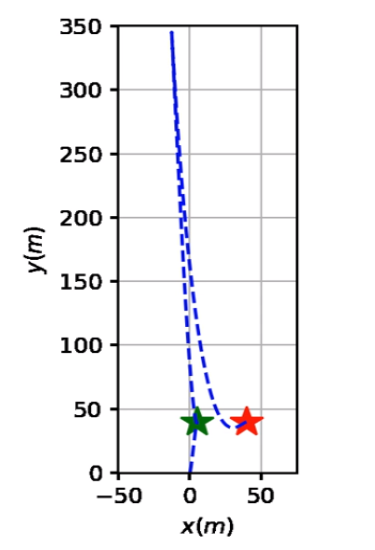
 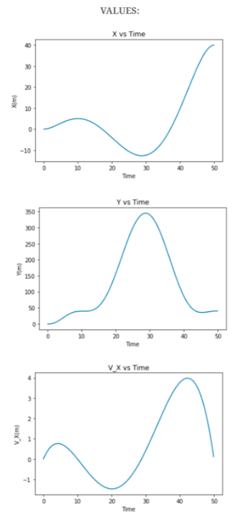
 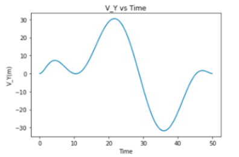

As expected, the initial and final velocities are 0 as per the given requirements.

2. Two Wayoints:
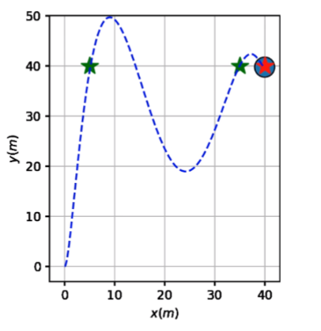
3. Three Waypoints:

#### How would you avoid collisions of a non-holonomic robot with trajectory fitted using Bernstein polynomials, with a static obstacle?

<b>Answer</b>: To be able to go around the object, we introduce more waypoints around the object and then fit the Bernstein polynomial with respect to those, to be able to avoid a static obstacle.

This is evident when we place a circular object and introduce waypoints around the object to make it convenient to reach the destination while avoiding the obstacle.

<b>Examples</b>: 
1. Example 1:    
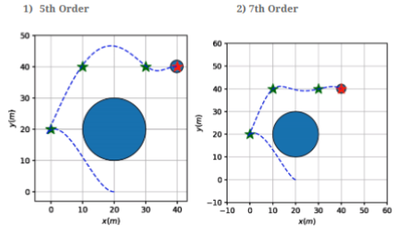
 
2. Example 2: 
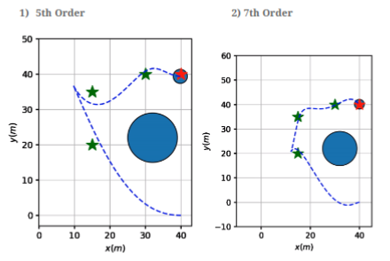
x vs t, y vs t, $v_{x}$ vs t graphs:
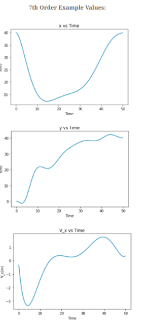
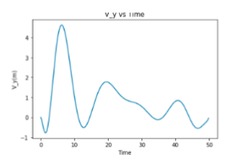

As expected, the initial and final velocities are 0 as per the given requirements.

#### What are the advantages of using Bernstein polynomials over other approximation techniques?

<b>Answer</b>: To be able to avoid collision of multiple nonholonomic trajectories approximated using Bernstein polynomials, we can <b>check for a potential collision at every single time step</b>. After that, we <b>slow down the robot</b> using the concept of <b>time-scaling</b> to be able to avoid collisions when multiple robots are involved.

#### What are the advantages of using Bernstein polynomials over other approximation techniques?

<b>Answer:</b> The Bernstein polynomial and its derivatives can <b>efficiently approximate both the function (f) and its derivative (f_dot)</b>. This can also be extended for higher derivatives.

### Trying with higher/lower order of Bernstein polynomials and report your observations

1. 3rd Order Polynomial:
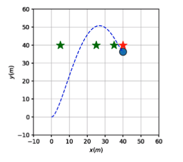

3. 5th Order Polynomial:
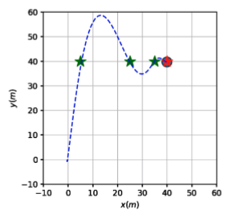
4. 7th Order Polynomial:
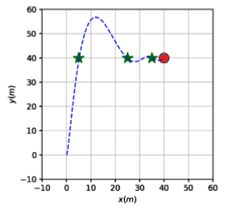

<b>Observations:</b>
We notice that as the order increases, the trajectory generated is much more stable and converges better. This is expected as with more coefficients in high order, we can approximate the trajectory passing by the waypoints in a better fashion.

The basis of the Berstein polynomials have a <b>numerically stable basis</b>.

##### To make more recordings

In `mkmovie.sh` enter the path to the directory where the snapshots are stored and edit the name of the simulation. For example, if my simulation screenshots are stored in the directory `nonhn_tree/`, I will run the following command:

`ffmpeg -r 2 -f image2 -i nonhn_tree/snap%d.png -s 1000x1000 -pix_fmt yuv420p -y simulation.mp4`

### Videos Link: 
[Video Demo Link](https://iiitaphyd-my.sharepoint.com/:f:/g/personal/aravind_narayanan_students_iiit_ac_in/Eu3xQyMHT5FKtLm1d_Z8An8BwizjHAcC8OzbLc1FQEDNWA?e=n4L9lv)
